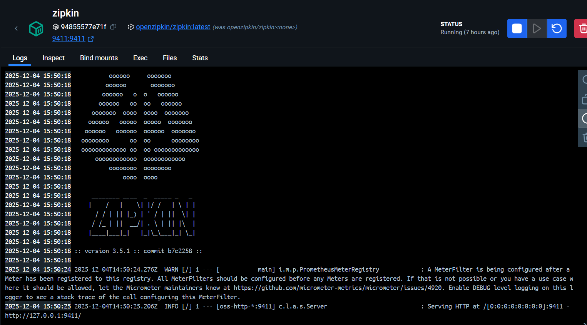
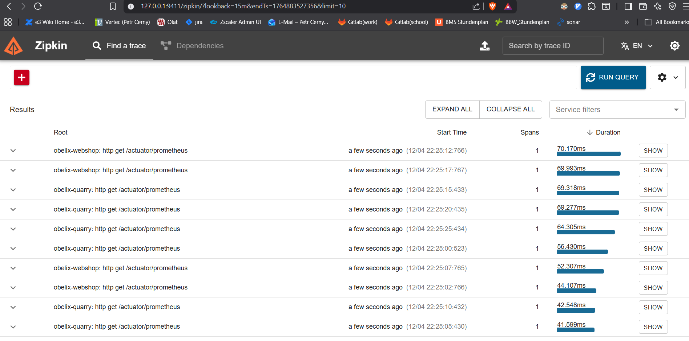
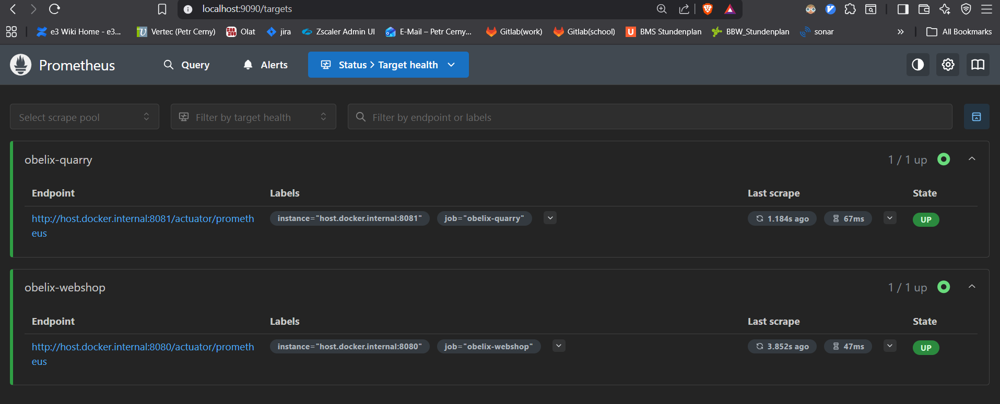
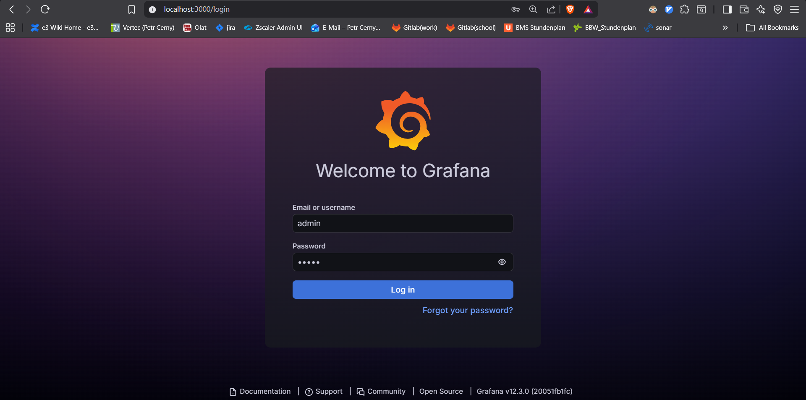
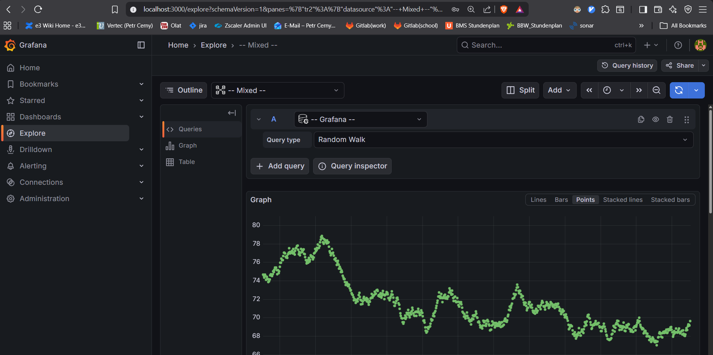

# Obelix & Co. Webshop 🪨

Currently, everything is under `obelix-webshop`, but we have great plans to split parts to split the most important part, my standing stones, into its own microservice.
Gradle subprojects are already in place, ready for the great change.

## 1. Observability-Stack starten

Zuerst die Tools, die für das Monitoring und Tracing der Anwendung starten.

1.  Terminal im Hauptverzeichnis öffnen.
2.  folgenden Befehl ausführen um Grafana, promethues und Zipkin zu starten:

    ```bash
    docker-compose up -d
    ```

### Zipkin

Zipkin -> Tracing-System (Verfolgt anfragen über die Microservices)

*   **URL**: [http://localhost:9411](http://localhost:9411)

**
**

### Prometheus

Prometheus -> Monitoring-System (Metriken der Dienste wie CPU-usage)

*   **URL**: [http://localhost:9090](http://localhost:9090)

****

### Grafana

Grafana -> Visualisierungs-Tool (Verbindet sich mit Prometheus und zeigt die daten auf dashboard)

*   **URL**: [http://localhost:3000](http://localhost:3000)
*   **Login**: `admin` / `admin`  -> defaults :)

****
****

## 2. Microservices starten

nachdem alles läuft die Microservices starten.

### obelix-quarry-impl

`obelix-quarry-impl`-Service -> Verwaltung der Menhire

### obelix-webshop

`obelix-webshop` -> Hauptanwendung

## 3. Anwendung testen

Nachdem alles läuft sind die Anwendungen afu Port `8080` & `8081`

*   **Webshop**: [http://localhost:8080](http://localhost:8080)
*   **Quarry API**: [http://localhost:8081/api/menhirs](http://localhost:8081/api/menhirs)


Leider kein Livestream ;)
